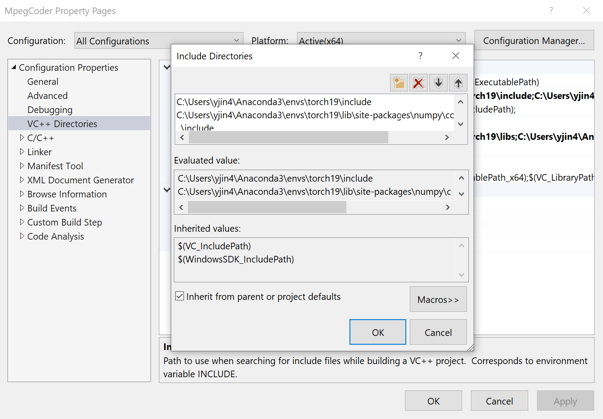

# FFmpeg-Encoder-Decoder-for-Python

This is a mpegCoder adapted from FFmpeg & Python-c-api. Using it you could get access to processing video easily. Just use it as a common module in python like this.

```python
import mpegCoder
```

|     Branch      |  Description  |
| :-------------: | :-----------: |
| `master` :link: | The source project of `mpegCoder`, Windows version. |
| [`master-linux` :link:][git-linux] | The source project of `mpegCoder`, Linux version. |
| [`example-client-check` :link:][exp1] | A testing project of the online video stream demuxing. |
| [`example-client-player` :link:][exp2] | A testing project of the simple online video stream player. |

## Source project of `mpegCoder` (Windows)

The following instructions are used for building the project on Windows with Visual Studio 2019.

1. Clone the `master` branch which only contains the codes of `mpegCoder`:

    ```bash
    git clone --single-branch -b master https://github.com/cainmagi/FFmpeg-Encoder-Decoder-for-Python.git
    ```

2. Download the FFMpeg dependencies, including `include` and `lib`. Users could download dependencies manually by checking [the release page :link:](https://github.com/cainmagi/FFmpeg-Encoder-Decoder-for-Python/releases/tag/deps-3.0.0). However, we recommend users to use the following script to get the dependencies quickly:

    ```bash
    python webtools.py
    ```

    This script requires users to install `urllib3`. The `tqdm` is also recommended to be installed.

3. The following configurations should be set for `All` (both debug and release) and `x64`. Open the project by `MpegCoder.sln`. Then configure the following paths of the include directories and the library directories. In both configurations, the first item is required to be modified according to your python path, the second item is required to be modified according to your numpy path.

    |  Path  |  Screenshot  |
    | :----- | :----------: |
    | `includes` |  |
    | `libs` |  |

4. Modify the linker configs. We only need to change the item `python3x.lib` according to the python version you have.
    

5. Run the `Release`, `x64` build. The built file should be saved as `x64\Release\mpegCoder.pyd`.

6. The `mpegCoder.pyd` should be used together with the FFMpeg shared libraries, including:

    ```shell
    avcodec-59.dll
    avformat-59.dll
    avutil-57.dll
    swresample-4.dll
    swscale-6.dll
    ```

## Update reports

Has been moved to [:bookmark_tabs: CHANGELOG.md](./CHANGELOG.md)

## Version of currently used FFmpeg library

Current FFMpeg version is `5.0`.

|   Dependency    |    Version     |
| :-------------: | :------------: |
| `libavcodec`    | `59.18.100.0` |
| `libavformat`   | `59.16.100.0`  |
| `libavutil`     | `57.17.100.0`  |
| `libswresample` | `4.3.100.0`    |
| `libswscale`    | `6.4.100.0`    |

[git-linux]:https://github.com/cainmagi/FFmpeg-Encoder-Decoder-for-Python/tree/master-linux "master (Linux)"
[exp1]:https://github.com/cainmagi/FFmpeg-Encoder-Decoder-for-Python/tree/example-client-check "check the client"
[exp2]:https://github.com/cainmagi/FFmpeg-Encoder-Decoder-for-Python/tree/example-client-player "client with player"
